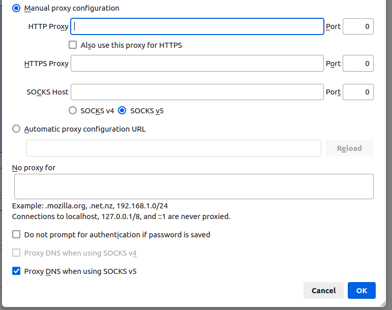

# Terraform AWS config

This terraform config is to create a simple EC2 instance.

This EC2 instance is used to SSH forward through browser ( Firefox ).

This terraform config is to run on local environment because it's adding a SSH rule to allow your local IP address.

TODO :

- create SSH config
- use terraform provisionner to deploy SSH server configuration
- use Ansible to deploy SSH server configuration
